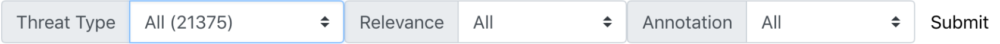
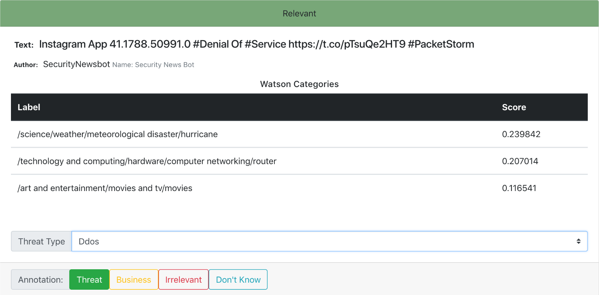

# CyberTweets

CyberTweets is part of a bigger project that focuses to identify and discover real time cyber threats in computing system using machine learning approaches applied on the datasets gathered from different open source online network such as online social networks, security blogs, technical forums etc. and sources.

CyberTweets repository contains the dataset of already annotated tweets as well as the web application used to annotate the tweets. The web application is a flask application. The dataset is a dump of a MongoDB collection.

## Table of Contents
1. [Installation](#Installation)
    1. [Data Set](#Dataset)
    2. [Web Application](#WebApplication)
2. [Database](#Database)
    1. [Structure](#Structure)
3. [Web Application](#WebAnnotator)
4. [Citation](#Citation)

## Installation <a name="Installation"></a>

The repository consists of two directories: `threat/` and `webapp/`. `threat/` contains a copy of our dataset of already annotated tweets in MongoDB dump files, and `webapp/` is the web annotator application used to annotate the dataset.

### Data Set <a name="Dataset"></a>

> Make sure you have the latest version of MongoDB installed on your computer. 
> For more information for MongoDB installation there are some tutorials available here: https://docs.mongodb.com/manual/installation/

Once you have installed MongoDB correctly and you have an instance of mongo server running on the default port `27017` , restore the database by running the following commands:
```
cd threat/
mongorestore -d threat .
```
Now you should have a database called `threat` that contains a collection called `tweets`.

### Web Application <a name="WebApplication"></a>

The web application for annotations is in the `webapp/` directory. Python 3 is needed for running the application. To install libraries and dependencies simply run from the project home:
```
cd webapp/
pip3 install -r requirements.txt
```

## Database

### Structure <a name="Structure"></a>

Mongo tweet collection scheme
```python
{
  _id : ObjectId(),     # MongoDB autogenerated id
  date: ISODate(),      # Date tweet was retrieved
  id: int,              # Tweet id given by twitter
  relevant: Boolean,    # preannotation done automatically from ibm watson topic modeling: true if classification is relevant
  text: string,         # tweet text
  tweet: {},            # Original tweet object crawled from twitter
  type: [string],       # List of types of vulnerabilities that this tweet represents (so far there is only one vulnerability type per tweet annotated by user
  watson: {},           # Watson object that is the result from running topic modeling on IBM Watson
  annotation: string    # "relevant", "irrelevant" or "business" depending on the annotation by user
}
```

## Web Application <a name="WebAnnotator"></a>

### Run

To run the web application, simply run:
```
cd webapp/
python3 main.py
```

This will run the web application on port 5000 and be accessible as `localhost:5000`

### Web Annotator Usage

#### To Query

Simply select the threat type, relevance and annotation values of the tweets desired and then click on submit.



#### To Annotate

Here is an example of a tweet component



##### Threat type annotation:
Select a threat type from the drop-down menu inside a tweet component. The web application will annotate and update the MongoDB after selecting a type

##### Relevance annotation:
Select a relevance level by pressing a button: `threat`, `business`, `irrelevant` or `don't know`.

## Citation

1. Behzadan, V., Aguirre, C., Bose, A., & Hsu, W. (2018). Corpus and Deep Learning Classifier for Collection of Cyber Threat Indicators in Twitter Stream. Proceedings of the IEEE International Conference on Big Data 2018 (IEEE BigData 2018) Workshop on Big Data Analytics for Cyber Threat Hunting (CyberHunt 2018), Seattle, WA, USA, December 10-13, 2018.

